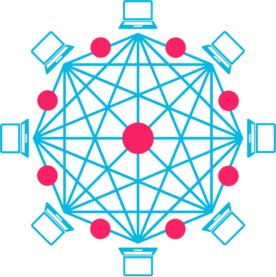

[![Contributors][contributors-shield]][contributors-url]
[![Forks][forks-shield]][forks-url]
[![Stargazers][stars-shield]][stars-url]
[![Issues][issues-shield]][issues-url]
[![MIT License][license-shield]][license-url]

<!-- PROJECT LOGO -->
<br />
<p align="center">
  <a href="https://github.com/mysticaltech/kube-hetzner">
    
  </a>

  <h2 align="center">Kube-Hetzner</h2>

  <p align="center">
    A highly optimized and auto-upgradable, HA-default & Load-Balanced, Kubernetes cluster powered by k3s-on-MicroOS and deployed for peanuts on <a href="https://hetzner.com" target="_blank">Hetzner Cloud</a> 🤑 🚀
  </p>
  <hr />
</p>

ℹ️ _This project is still in development and changing rapidly. Soon enough we will have a stable release with semver-compliant versions. Thank you for your patience!_

## About The Project

[Hetzner Cloud](https://hetzner.com) is a good cloud provider that offers very affordable prices for cloud instances, with data center locations in both Europe and the US.

The goal of this project is to create an optimal and highly optimized Kubernetes installation that is easily maintained, secure, and automatically upgrades. We aimed for functionality as close as possible to GKE's auto-pilot.

In order to achieve this, we built it on the shoulders of giants, by choosing [openSUSE MicroOS](https://en.opensuse.org/Portal:MicroOS) as the base operating system, and [k3s](https://k3s.io/) as the Kubernetes engine.

_Please note that we are not affiliated to Hetzner, this is just an open source project striving to be an optimal solution for deploying and maintaining Kubernetes on Hetzner Cloud._

### Features

- Maintenance free with auto-upgrade to the latest version of MicroOS and k3s.
- Proper use of the underlying Hetzner private network to remove the need for encryption and minimize latency.
- Automatic HA with the default setting of three control-plane and two agents nodes.
- Ability to add or remove as many nodes as you want while the cluster stays running.
- Automatic Traefik ingress controller attached to a Hetzner load balancer with proxy protocol turned on.
- (Optional) Out of the box config of Traefik with SSL certficate auto-generation.

_It uses Terraform to deploy as it's easy to use, and Hetzner provides a great [Hetzner Terraform Provider](https://registry.terraform.io/providers/hetznercloud/hcloud/latest/docs)._

![Product Name Screen Shot][product-screenshot]

<!-- GETTING STARTED -->

## Getting Started

Follow those simple steps, and your world's cheapest Kube cluster will be up and running in no time.

### ✔️ Prerequisites

First and foremost, you need to have a Hetzner Cloud account. You can sign up for free [here](https://hetzner.com/cloud/).

Then you'll need to have [terraform](https://learn.hashicorp.com/tutorials/terraform/install-cli) and [kubectl](https://kubernetes.io/docs/tasks/tools/) cli installed. The easiest way is to use the [gofish](https://gofi.sh/#install) package manager to install them.

```sh
gofish install terraform
gofish install kubectl
```

_The Hetzner cli `hcloud` is also useful to have, mainly for debugging without having to use the Hetzner website. See how to install it [here](https://github.com/hetznercloud/cli)._

### 💡 [Do not skip] Creating the terraform.tfvars file

1. Create a project in your [Hetzner Cloud Console](https://console.hetzner.cloud/), and go to **Security > API Tokens** of that project to grab the API key. Take note of the key! ✅
2. Either, generate a passphrase-less ed25519 SSH key-pair for your cluster, unless you already have one that you'd like to use. Take note of the respective paths of your private and public keys. Or, for a key-pair with passphrase or a device like a Yubikey, make sure you have have an SSH agent running and your key is loaded (`ssh-add -L` to verify) and set `private_key = null` in the following step. ✅
3. Copy `terraform.tfvars.example` to `terraform.tfvars`, and replace the values from steps 1 and 2. ✅
4. (Optional) There are other variables in `terraform.tfvars` that could be customized, like Hetzner region, and the node counts and sizes.

### 🎯 Installation

```sh
terraform init
terraform apply -auto-approve
```

It will take around 12 minutes to complete, and then you should see a green output with the IP addresses of the nodes. Then you can immediately kubectl into it (using the kubeconfig.yaml saved to the project's directory after the install).

_Just using the command `kubectl --kubeconfig kubeconfig.yaml` would work, but for more convenience, either create a symlink from `~/.kube/config` to `kubeconfig.yaml`, or add an export statement to your `~/.bashrc` or `~/.zshrc` file, as follows (you can get the path of kubeconfig.yaml by running `pwd`):_

```sh
export KUBECONFIG=/<path-to>/kubeconfig.yaml
```

<!-- USAGE EXAMPLES -->

## Usage

When the cluster is up and running, you can do whatever you wish with it! 🎉

### Scaling Nodes

⚠️ Once you start with Terraform, it's best not to change the state manually in Hetzner, otherwise when you try to scale up or down, Terraform will complain that things changed outside of it and will not be able to do it. _In the future, we will provide a tool to create bare nodes, either agents or control planes, to be joined manually._

To scale the number of nodes up or down, just make sure to properly `kubectl drain` the nodes in question first if scaling down. Then just edit these variables in `terraform.tfvars` and re-apply terraform with `terraform apply -auto-approve`.

For instance:

```tfvars
servers_num = 4
agents_num = 3
```

### Useful Commands

- List your nodes IPs, with either of those:

```sh
terraform outputs
hcloud server list
```

- See the Hetzner network config:

```sh
hcloud network describe k3s
```

- Log into one of your nodes (replace the location of your private key if needed):

```sh
ssh root@xxx.xxx.xxx.xxx -i ~/.ssh/id_ed25519 -o StrictHostKeyChecking=no
```

## High Availability

By default, we have 3 control planes and 2 agents configured, with automatic upgrades and reboots of the nodes.

If you want to remain HA (no downtime), it's important to **keep a number of control planes nodes of at least 3** (2 minimum to maintain quorum when 1 goes down for automated upgrades and reboot), see [Rancher's doc on HA](https://rancher.com/docs/k3s/latest/en/installation/ha-embedded/).

Otherwise, it's important to turn off automatic upgrades of the OS only (k3s can continue to update without issue) for the control-plane nodes (when 2 or less control-plane nodes), and do the maintenance yourself.

## Automatic Upgrade

By default, MicroOS gets upgraded automatically on each node, and reboot safely via [Kured](https://github.com/weaveworks/kured) installed in the cluster.

As for k3s, it also automatically upgrades thanks to Rancher's [system upgrade controller](https://github.com/rancher/system-upgrade-controller). By default it follows the k3s `stable` channel, but you can also change to `latest` one if needed, or specify a target version to upgrade to via the upgrade plan.

You can copy and modify the [one in the templates](https://github.com/kube-hetzner/kube-hetzner/blob/master/templates/plans.yaml.tpl) for that! More on the subject in [k3s upgrades basic](https://rancher.com/docs/k3s/latest/en/upgrades/basic/).

_If you wish to turn off automatic MicroOS upgrades on a specific node, you need to ssh into it and issue the following command:_

```sh
systemctl --now disable transactional-update.timer
```

_To turn off k3s upgrades, you can either set the `k3s_upgrade=true` label in the node you want, or set it to `false`. To just remove it, apply:_

```sh
kubectl -n system-upgrade label node <node-name> k3s_upgrade-
```

## Examples

<details>
<summary>Ingress with TLS</summary>

Here is an example of an ingress to run an application with TLS, change the host to fit your need in `examples/tls/ingress.yaml` and then deploy the example:

```sh
kubectl apply -f examples/tls/.
```

```yml
apiVersion: networking.k8s.io/v1
kind: Ingress
metadata:
  name: nginx-ingress
  annotations:
    traefik.ingress.kubernetes.io/router.tls: "true"
    traefik.ingress.kubernetes.io/router.tls.certresolver: le
spec:
  tls:
    - hosts:
        - example.com
      secretName: example-tls
  rules:
    - host: example.com
      http:
        paths:
          - path: /
            pathType: Prefix
            backend:
              service:
                name: nginx-service
                port:
                  number: 80

```

</details>
<br />

## Takedown

If you want to takedown the cluster, you can proceed as follows:

```sh
hcloud load-balancer delete traefik
hcloud network delete k3s
terraform destroy -auto-approve
```

_Also, if you had a full-blown cluster in use, it would be best to delete the whole project in your Hetzner account directly as operators or deployments may create other resources during regular operation._

<!-- CONTRIBUTING -->

## History

This project has tried two other OS flavors before settling on MicroOS. Fedora Server, and k3OS. The latter, k3OS, is now defunct! However, our code base for it lives on in the [k3os branch](https://github.com/kube-hetzner/kube-hetzner/tree/k3os). Do not hesitate to check it out, it should still work.

There is also a branch where openSUSE MicroOS came preinstalled with the k3s RPM from devel:kubic/k3s, but we moved away from that solution as the k3s version was rarely getting updates. See the [microOS-k3s-rpm](https://github.com/kube-hetzner/kube-hetzner/tree/microOS-k3s-rpm) branch for more.

## Contributing

✅ There is something you can do right away to help this project succeed! **Just take a few minutes to send a support request to Hetzner, asking them to please add openSUSE MicroOS as a default image**, not just an ISO. If that succeeds, we will be able to deploy in less than 2 minutes instead of 5, without passing by the rescue mode. The more requests they receive the likelier they are to add it. The official link to openSUSE MicroOS is <https://get.opensuse.org/microos>.

About code contributions, they are **greatly appreciated**.

1. Fork the Project
2. Create your Branch (`git checkout -b AmazingFeature`)
3. Commit your Changes (`git commit -m 'Add some AmazingFeature'`)
4. Push to the Branch (`git push origin AmazingFeature`)
5. Open a Pull Request

<!-- ACKNOWLEDGEMENTS -->

## Acknowledgements

- [k-andy](https://github.com/StarpTech/k-andy) was the starting point for this project. It wouldn't have been possible without it.
- [Best-README-Template](https://github.com/othneildrew/Best-README-Template) that made writing this readme a lot easier.
- [Hetzner Cloud](https://www.hetzner.com) for providing a solid infrastructure and terraform package.
- [Hashicorp](https://www.hashicorp.com) for the amazing terraform framework that makes all the magic happen.
- [Rancher](https://www.rancher.com) for k3s, an amazing Kube distribution that is the very core engine of this project.
- [openSUSE](https://www.opensuse.org) for MicroOS, which is just next level Container OS technology.

[contributors-shield]: https://img.shields.io/github/contributors/mysticaltech/kube-hetzner.svg?style=for-the-badge
[contributors-url]: https://github.com/mysticaltech/kube-hetzner/graphs/contributors
[forks-shield]: https://img.shields.io/github/forks/mysticaltech/kube-hetzner.svg?style=for-the-badge
[forks-url]: https://github.com/mysticaltech/kube-hetzner/network/members
[stars-shield]: https://img.shields.io/github/stars/mysticaltech/kube-hetzner.svg?style=for-the-badge
[stars-url]: https://github.com/mysticaltech/kube-hetzner/stargazers
[issues-shield]: https://img.shields.io/github/issues/mysticaltech/kube-hetzner.svg?style=for-the-badge
[issues-url]: https://github.com/mysticaltech/kube-hetzner/issues
[license-shield]: https://img.shields.io/github/license/mysticaltech/kube-hetzner.svg?style=for-the-badge
[license-url]: https://github.com/mysticaltech/kube-hetzner/blob/master/LICENSE.txt
[product-screenshot]: .images/kubectl-pod-all-17022022.png
